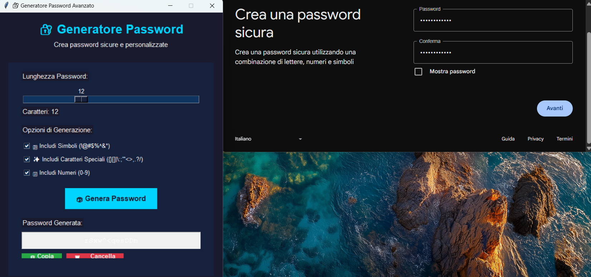

# 🔒 Custom Password Generator

A secure and customizable password generator with graphical interface, featuring real-time strength evaluation and clipboard support.

## ✨ Features

- **Password Length Control**
  - Adjustable slider (6-25 characters)
  - Visual length indicator

- **Character Customization**
  - [x] Uppercase letters (A-Z)
  - [x] Lowercase letters (a-z)
  - [x] Numbers (0-9)
  - [x] Symbols (!@#$%^&*)
  - [x] Special characters ({}[]|:;"'<>,.?/)

- **Security Tools**
  - Real-time strength meter (Weak/Medium/Strong)
  - Password complexity evaluation
  - Copy protection warning

- **Convenience Functions**
  - One-click copy to clipboard
  - Clear field button
  - Regenerate button

## 🖥️ Screenshot
Execute and click Genera Password:
 

The password generated is hidden press the green button "Copia":
 

Paste your hidden password where you prefer:
 

Enjoy :)

## 🚀 Quick Start

1. Install dependencies:
```bash
pip install pyperclip
